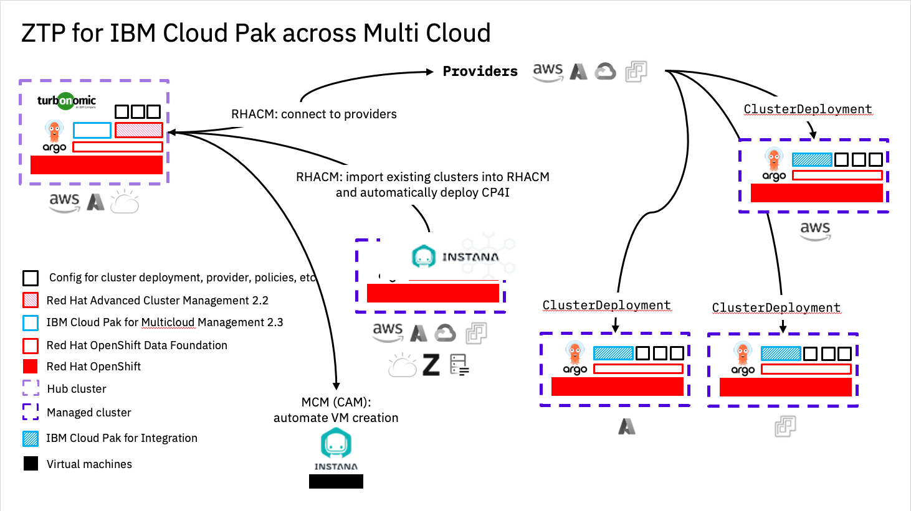

# Zero Touch Provisioning for IBM Cloud Pak across Multi Cloud

## Elevator Pitch

This asset is our opinionated implementation of the GitOps principles, using the latest and greatest tooling available, to enable our customers to hit one big red button (figuratively) to start provisioning a platform that provides Cluster and Virtual Machine Provisioning capabilities, Governence and policy management, observability of Clusters and workloads and finally deployment of IBM Cloud Paks, all within a single command*. Codified, Repeatable and Auditable.


*Disclaimer, may actually be more than just one command to type. ;)


The asset is not intended to be used straight into Production, and a lot of assumptions have been made when putting this together. It's main intention is to show the `Art of the Possible`, but it can be used a base to roll your own.

Whilst all efforts have been made to provide a complete `Zero Touch Provisioning` asset, it may not suit every environment and your mileage may vary.

### Shout outs

This asset has been built on the shoulders of giants and leverages the great work and effort undertaken by the [Cloud Native Toolkit - GitOps Production Deployment Guide](https://github.com/cloud-native-toolkit/multi-tenancy-gitops) and [IBM Garage TSA](https://github.com/ibm-garage-tsa/cp4mcm-installer) teams. Without those efforts, then this asset would have struggled to get off the ground.

The reference architecture for this GitOps workflow can be found [here](https://cloudnativetoolkit.dev/adopting/use-cases/gitops/gitops-ibm-cloud-paks/).  

## Table of contents

- [Zero Touch Provisioning for IBM Cloud Pak across Multi Cloud](#zero-touch-provisioning-for-ibm-cloud-pak-across-multi-cloud)
  - [Elevator Pitch](#elevator-pitch)
    - [Shout outs](#shout-outs)
  - [Table of contents](#table-of-contents)
  - [Pre-requisites](#pre-requisites)
    - [Note](#note)
    - [Red Hat OpenShift cluster](#red-hat-openshift-cluster)
      - [IPI Methods](#ipi-methods)
      - [UPI Methods](#upi-methods)
      - [Managed OpenShift](#managed-openshift)
      - [Future Platforms](#future-platforms)
    - [CLI tools](#cli-tools)
    - [IBM Entitlement Key](#ibm-entitlement-key)
  - [Setup git repositories](#setup-git-repositories)
    - [Tasks:](#tasks)
  - [Install and configure OpenShift GitOps](#install-and-configure-openshift-gitops)
    - [Tasks:](#tasks-1)
    - [Configure manifests for Infrastructrure](#configure-manifests-for-infrastructrure)
  - [Bootstrap the OpenShift cluster](#bootstrap-the-openshift-cluster)
    - [Tasks:](#tasks-2)
  - [The resources to be deployed](#the-resources-to-be-deployed)
    - [Tasks:](#tasks-3)


## Pre-requisites

### Note

This respository is not intended to be a Step-by-Step Guide and some prior knowledge in OpenShift/Kubernetes/VM Provisioning is expected.

This repository provides an opinionated point of view on how tooling such as `Terraform`, `Ansible` and `GitOps` can be used to manage the infrastructure, services and application layers of OpenShift/Kubernetes based systems.  It takes into account the various personas interacting with the system and accounts for separation of duties.

It is assumed that you have already configured the compute, networks, storage, Security Groups, Firewalls, VPC, etc to enable the platform to be deployed. The asset will not
perform those actions for you, and it will fail if you attempt to deploy it without those all pre-configured.

### Red Hat OpenShift cluster

Minimum OpenShift v4.7+ is required.

Firstly, build a "bare-bones" Red Hat OpenShift cluster using either IPI (Installer Provisioned Infrastructure), UPI (User Provisioned Infrastructure) methods or a Managed OpenShift offering like IBM Cloud - ROKS.

#### IPI Methods

- [AWS](https://docs.openshift.com/container-platform/4.7/installing/installing_aws/installing-aws-default.html)
- [Azure](https://docs.openshift.com/container-platform/4.7/installing/installing_azure/installing-azure-default.html)
- [VMWare](https://docs.openshift.com/container-platform/4.7/installing/installing_vsphere/installing-vsphere-installer-provisioned.html)

#### UPI Methods

Leveraging the work undertaken by the Cloud Native Toolkit team, you can utilise the following Github repositories to assist you with your UPI install of OpenShift.

- [Azure](https://github.com/ibm-cloud-architecture/terraform-openshift4-azure)
- [AWS](https://github.com/ibm-cloud-architecture/terraform-openshift4-aws)
- [VMWare](https://github.com/ibm-cloud-architecture/terraform-openshift4-vmware)
- [IBM Cloud VMWare Cloud Director](https://github.com/ibm-cloud-architecture/terraform-openshift4-vcd)
- [GCP](https://github.com/ibm-cloud-architecture/terraform-openshift4-gcp)

#### Managed OpenShift

- [IBM Cloud - ROKS](https://cloud.ibm.com/kubernetes/catalog/create?platformType=openshift)

#### Future Platforms

The following platforms can be used as a Hub Cluster once Red Hat Advanced Cluster Management Version 2.4 becomes GA (ETA Q4 21)

- [IBM Power Systems - PowerVC](https://github.com/ocp-power-automation/ocp4-upi-powervm)
- [IBM Power Systems - HMC](https://github.com/ocp-power-automation/ocp4-upi-powervm-hmc)
- [IBM Cloud PowerVS](https://github.com/ocp-power-automation/ocp4-upi-powervs)

### CLI tools

- Install the OpenShift CLI oc (version 4.7+) .  The binary can be downloaded from the Help menu from the OpenShift Console.

    <details>
    <summary>Download oc cli</summary>

    
    </details>

- Install kubeseal from brew.sh

   ```bash
   brew install kubeseal
   ```

- Install cloudctl

   ```bash
   wget https://github.com/IBM/cloud-pak-cli/releases/latest/download/cloudctl-darwin-amd64.tar.gz
   tar -xzf cloudctl-darwin-amd64.tar.gz
   ``` 

- Log in from a terminal window.

    ```bash
    oc login --token=<token> --server=<server>
    ```

### IBM Entitlement Key

- An `IBM Entitlement Key` is required to pull IBM Cloud Pak specific container images from the IBM Entitled Registry.

To get an entitlement key:

1. Log in to [MyIBM Container Software Library](https://myibm.ibm.com/products-services/containerlibrary) with an IBMid and password associated with the entitled software.  
2. Select the **View library** option to verify your entitlement(s).
3. Select the **Get entitlement key** to retrieve the key.

- Create a **Secret** containing the entitlement key within the `ibm-cp4mcm` namespace.

    ```bash
    oc new-project ibm-cp4mcm || true
    oc create secret docker-registry ibm-entitlement-key -n ibm-cp4mcm \
    --docker-username=cp \
    --docker-password="<entitlement_key>" \
    --docker-server=cp.icr.io \
    --docker-email=myemail@ibm.com
    ```

## Setup git repositories

- The following set of Git repositories will be used for our GitOps workflow.  

    - Main GitOps repository ([https://github.com/apac-mcm-aiops-asset/mcm-aiops-gitops](https://github.com/apac-mcm-aiops-asset/mcm-aiops-gitops)): This repository contains all the ArgoCD Applications for  the `infrastructure`, `services` and `application` layers.  Each ArgoCD Application will reference a specific K8s resource (yaml resides in a separate git repository), contain the configuration of the K8s resource, and determine where it will be deployed into the cluster.  

    - Infrastructure GitOps repository ([https://github.com/apac-mcm-aiops-asset/mcm-aiops-gitops-infra](https://github.com/apac-mcm-aiops-asset/mcm-aiops-gitops-infra)): Contains the YAMLs for cluster-wide and/or infrastructure related K8s resources managed by a cluster administrator.  This would include `namespaces`, `clusterroles`, `clusterrolebindings`, `machinesets` to name a few.

    - Services GitOps repository ([https://github.com/apac-mcm-aiops-asset/mcm-aiops-gitops-services](https://github.com/apac-mcm-aiops-asset/mcm-aiops-gitops-services)): Contains the YAMLs for K8s resources which will be used by the `application` layer.  This could include `subscriptions` for Operators, YAMLs of custom resources provided, or Helm Charts for tools provided by a third party.  These resource would usually be managed by the Administrator(s) and/or a DevOps team supporting application developers.

    - Apps GitOps repository ([https://github.com/apac-mcm-aiops-asset/mcm-aiops-gitops-apps](https://github.com/apac-mcm-aiops-asset/mcm-aiops-gitops-apps)): Contains the YAMLs for K8s resources to deploy `applications`. Within this asset, we treat Managed OpenShift clusters as `applications`.

    - VM repository : Contains the YAMLs for deploying Virtual Machines.

### Tasks:

1. Create a new GitHub Organization using instructions from this [GitHub documentation](https://docs.github.com/en/organizations/collaborating-with-groups-in-organizations/creating-a-new-organization-from-scratch).
2. From each template repository, click the `Use this template` button and create a copy of the repository in your new GitHub Organization.
    
3. Clone the repositories locally.

    ```bash
    mkdir -p gitops-repos
    cd gitops-repos
    
    # Example: set default Git org for clone commands below
    GIT_ORG=apac-mcm-aiops-asset

    # Clone using SSH
    git clone git@github.com:$GIT_ORG/mcm-aiops-gitops.git
    git clone git@github.com:$GIT_ORG/mcm-aiops-gitops-infra.git
    git clone git@github.com:$GIT_ORG/mcm-aiops-gitops-services.git
    git clone git@github.com:$GIT_ORG/mcm-aiops-gitops-apps.git
    ```

4. Update the default Git URl and branch references in your `mcm-aiops-gitops` repository by running the provided script `./scripts/set-git-source.sh` script.

    ```bash
    cd mcm-aiops-gitops
    GIT_ORG=<GIT_ORG> GIT_BRANCH=master ./scripts/set-git-source.sh
    git add .
    git commit -m "Update Git URl and branch references"
    git push origin master
    ```

## Install and configure OpenShift GitOps

- [Red Hat OpenShift GitOps](https://docs.openshift.com/container-platform/4.7/cicd/gitops/understanding-openshift-gitops.html) uses [Argo CD](https://argoproj.github.io/argo-cd/), an open-source declarative tool, to maintain and reconcile cluster resources.

### Tasks:

1. Install the OpenShift GitOps Operator and create a `ClusterRole` and `ClusterRoleBinding`.  

    ```bash
    oc apply -f setup/ocp47/
    while ! oc wait crd applications.argoproj.io --timeout=-1s --for=condition=Established  2>/dev/null; do sleep 30; done
    while ! oc wait pod --timeout=-1s --for=condition=Ready -l '!job-name' -n openshift-gitops > /dev/null; do sleep 30; done
    ```

2. Create a custom ArgoCD instance with custom checks

    ```bash
    oc apply -f setup/ocp47/argocd-instance/ -n openshift-gitops
    while ! oc wait pod --timeout=-1s --for=condition=ContainersReady -l app.kubernetes.io/name=openshift-gitops-cntk-server -n openshift-gitops > /dev/null; do sleep 30; done
    ```

### Configure manifests for Infrastructrure

If you are running a managed OpenShift cluster on IBM Cloud, you can deploy OpenShift Data Foundation as an add-on https://cloud.ibm.com/docs/openshift?topic=openshift-ocs-storage-prep#odf-deploy-options. Otherwise, on AWS, Azure, vSphere, run the following script to configure the machinesets, infra nodes and storage definitions for the `Cloud` you are using for the Hub Cluster

   ```bash
   ./scripts/infra-mod.sh
   ```

## Bootstrap the OpenShift cluster

- The bootstrap YAML follows the [app of apps pattern](https://argoproj.github.io/argo-cd/operator-manual/cluster-bootstrapping/#app-of-apps-pattern). 

### Tasks:

1. Retrieve the ArgoCD/GitOps URL and admin password and log into the UI
    ```bash
    oc get route -n openshift-gitops openshift-gitops-cntk-server -o template --template='https://{{.spec.host}}'
    oc extract secrets/openshift-gitops-cntk-cluster --keys=admin.password -n openshift-gitops --to=-
    ```

2. Deploy the ArgoCD Bootstrap Application.
    ```bash
    GITOPS_PROFILE="0-bootstrap/single-cluster"
    oc apply -f ${GITOPS_PROFILE}/bootstrap.yaml
    ```

## The resources to be deployed

- The resources required to be deployed for this asset have been pre-selected, and you should just need to clone the `mcm-aiops-gitops` repository in your Git Organization if you have not already done so and the resources selected in the [infrastructure](0-bootstrap/single-cluster/1-infra/kustomization.yaml) and [services](0-bootstrap/single-cluster/2-services/kustomization.yaml) layers will be deployed.

- The asset is set to automatically connect OpenShift Clusters running within vSphere and IBM Cloud into Red Hat Advanced Cluster Management. These are used as examples only, and you will need to replace this configuration files with your own. --- requires RHACM >2.3 * Manual steps are required for this initial version of the asset.

- Additionally, the asset will automatically create a connection to an AWS account and deploy an OpenShift Cluster into AWS via ArgoCD. Again, this configuration is for an example only and you will need to replace these files with your own.

- Connections to IaaS environments can be automatically done as part of the deployment of this asset. A basic example of this connecting to a vSphere Cluster is included as an example.

- The asset will provide example OpenShift Pipeline for deploying a Virtual Machine to the IaaS environment.

- Finally, we have included an example application which can deployed via GitOps to OpenShift Clusters configured into Red Hat Advanced Cluster Management.

### Tasks: 

1. Use the `single-cluster` profile.

    ```bash
    GITOPS_PROFILE="0-bootstrap/single-cluster"
    ```

2. Review the `Infrastructure` layer [kustomization.yaml](0-bootstrap/single-cluster/1-infra/kustomization.yaml) to view the resources that will be deployed.

3. Review the `Services` layer [kustomization.yaml](0-bootstrap/single-cluster/2-services/kustomization.yaml) to view the resources that will be deployed.  

4. Commit and push changes to your git repository

    ```bash
    git add .
    git commit -m "initial bootstrap setup"
    git push origin
    ```

5. Manually Patch MCM (Necessary due to MCM not playing nicely with ArgoCD)

   ```bash
   export ENTITLED_REGISTRY_SECRET=<entitlement_key>

   ./scripts/cp4mcm-post-install.sh
   ```
6. Review the `Applications` layer [kustomization.yaml](0-bootstrap/single-cluster/3-apps/kustomization.yaml) to review the resources that can be deployed.

  * We have provided a number of examples that can be copied to Create and Import IaaS Providers within MCM and similar with RHACM, where you can Create and Import OpenShift clusters. These examples are for guidance only and will not work if you attempt to deploy.

  * Creating and/or Importing IaaS Providers within MultiCloud Management
  
     * Details to follow.
  
  * Creating Clusters within Red Hat Advanced Cluster Management

     * We have have provided examples which can be used to deploy new clusters. These examples require the use of your Cloud Provider "keys" to allow RHACM to connect to your Cloud and deploy via Terraform an OpenShift cluster. We utilise SealedSecrets to encrypt your "keys" and have provided a handy script within the `Application` repo for your use.

  * Importing Clusters into Red Hat Advanced Cluster Management
  
     * Red Hat Advanced Cluster Management 2.2 lacks the use of the Discovery Service that's available within RHACM 2.3. This does mean that manual steps are required to be able to import existing OpenShift clusters. We have provided the ability to utilise ArgoCD for part of the process, but the final steps remain to be manual. Once we upgrade this asset to support RHAMC 2.3, we can reduce these manual steps.

     * An example of how you can perform the final steps of importing a cluster can be seen below. The use of OpenShift GitOps is used to firstly create all the resources needed by RHACM to perform an import, then once completed, you would follow the remaining steps. The aim in the future would be to automate these steps.

     * Uncomment the clusters you wish to import from `Application` [kustomization.yaml](0-bootstrap/single-cluster/3-apps/kustomization.yaml) file. 

    

    * OpenShift GitOps will then begin the Import routine, and once synced, complete the remaining steps listed below.


    ```bash
    OCP-VSPHERE="ocp-swinney-io"
    OCP-IBMCLOUD="syd-ibm-cloud"

    # Log into OCP Production Hub Cluster
    
    # Klusterlet-crd
    oc get secret ${OCP-VSPHERE}-import -n ${OCP-VSPHERE} -o jsonpath={.data.crds\\.yaml} | base64 --decode > ${OCP-VSPHERE}-klusterlet-crd.yaml
    oc get secret ${OCP-IBMCLOUD}-import -n ${OCP-IBMCLOUD} -o jsonpath={.data.crds\\.yaml} | base64 --decode > ${OCP-IBMCLOUD}-klusterlet-crd.yaml
    
    # managed-cluster-import
    oc get secret ${OCP-VSPHERE}-import -n ${OCP-VSPHERE} -o jsonpath={.data.import\\.yaml} | base64 --decode > ${OCP-VSPHERE}-managed-cluster-import.yaml
    oc get secret ${OCP-IBMCLOUD}-import -n ${OCP-IBMCLOUD} -o jsonpath={.data.import\\.yaml} | base64 --decode > ${OCP-IBMCLOUD}-managed-cluster-import.yaml
    
    # Log into vSphere Managed OCP Cluster
    oc apply -f ${OCP-VSPHERE}-klusterlet-crd.yaml
    oc apply -f ${OCP-VSPHERE}-managed-cluster-import.yaml
    
    # Log into IBM Cloud Managed OCP Cluster
    oc apply -f ${OCP-IBMCLOUD}-klusterlet-crd.yaml
    oc apply -f ${OCP-IBMCLOUD}-managed-cluster-import.yaml
    ```

    * Within a few minutes your Imported Clusters will show within RHACM.

    

7. The asset has been configured so that any OpenShift cluster that is imported or created, will be automatically configured with OpenShift GitOps and deployed with a custom ArgoCD controller.
   
    * This has been done to continue our GitOps approach within Managed Clusters. This is achieved through the use of Policies, which are automatically loaded into RHACM, which in turns uses these to ensure OpenShift GitOps is installed and remains installed in the event of accidently deletion.

8. The Managed Clusters are now ready for the deployment of Applications, again this is managed through OpenShift GitOps.

    * We will use IBM Cloud Pak for Integration (CP4i) as an example Application that can be deployed onto your Managed Clusters. As mentioned previously, we re-use the GitOps approach, and utilise OpenShift GitOps to configure the cluster ready for CP4i, through deploying OpenShift Container Storage, creating Nodes with the correct CPU and Memory, installing the necessary services and tools, and finally, deploy CP4i with MQ and ACE.

    * There is a few minor manual steps which need to be completed, and that is preparing the CP4i respository with your Cloud details and adding the IBM Cloud Pak Entitlement Secret into the Managed Cluster. In future, we aim to automate this step via SealedSecrets, Vault and Ansible Tower.

    We will re-use the [Cloud Native Toolkit - GitOps Production Deployment Guide](https://github.com/cloud-native-toolkit/multi-tenancy-gitops) repositories and it is assumed you have already configured these repostories by following the very comprehensive guide put together by that team. That configuration is beyond the scope of this asset.

   ```bash
   # Log into Managed Cluster via oc login
   oc login --token=<token> --server=<server> 

   # Clone the cp4i-cloudpak/multi-tenancy-gitops repository
   git clone git@github.com:cp4i-cloudpak/multi-tenancy-gitops.git

   cd multi-tenancy-gitops
   ./scripts/infra-mod.sh

   # Create an IBM Entitlement Secret within the tools namespace
   
   ## To get an entitlement key:
   ## 1. Log in to https://myibm.ibm.com/products-services/containerlibrary with an IBMid and password associated with the entitled software.  
   ## 2. Select the **View library** option to verify your entitlement(s). 
   ## 3. Select the **Get entitlement key** to retrieve the key.

    oc new-project tools || true
    oc create secret docker-registry ibm-entitlement-key -n tools \
    --docker-username=cp \
    --docker-password="<entitlement_key>" \
    --docker-server=cp.icr.io
   ```

7. Instana Agent Configuration

The prerequisites to install the Instana agent are:

Store your Instana Agent Key in a secret in the instana-agent namespace. The secret key field should contain key and the value contains your Instana Agent Key. Modify the instana-agent.agent.keysSecret value in the instances\instana-agent\values.yaml file to match the secret you deployed.

Modify the instana-agent.cluster.name value in the instances\instana-agent\values.yaml file which represents the name that will be assigned to this cluster in Instana.

Modify the instana-agent.zone.name value in the instances\instana-agent\values.yaml file which is the custom zone that detected technologies will be assigned to.